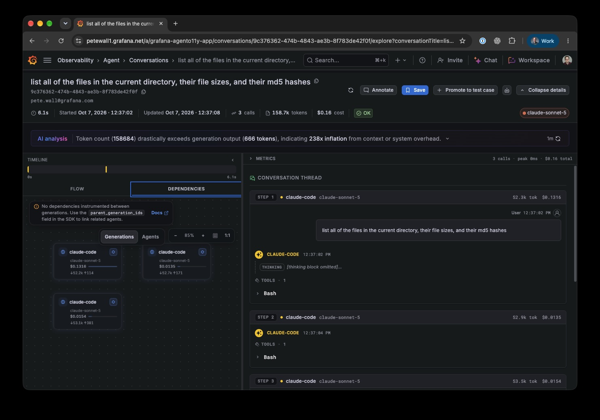

# agento11y sandbox kit

<p>
  
  &nbsp;&nbsp;+&nbsp;&nbsp;
  
</p>



This kit lets you capture coding-agent activity from an isolated Docker
Sandbox and send it to [Grafana Agent Observability
(agento11y)](https://github.com/grafana/agento11y). It installs the `agento11y`
tool when the sandbox starts and configures supported agents to send their
sessions to Grafana Cloud.

The kit is a **mixin**: an add-on that works alongside a **workload kit**, which
provides the coding agent itself (for example, Claude Code or Codex). The
credential is added by the sandbox's network proxy, so the raw Grafana token
does not need to be stored inside the container.

## Quick start

1. Install the Docker Sandboxes command-line tool (`sbx`) and Docker with
   `buildx` enabled.
2. Save your Grafana Cloud token as an `sbx` secret (step 1 below).
3. Build and publish this kit (step 2).
4. Set your Grafana Cloud endpoint and stack ID, then start a sandbox (step 3).

The sections below explain each step and the settings you can change.

## Agent support

The kit currently captures activity from these agents:

| Agent | Captured | Mechanism |
|---|---|---|
| Claude Code | ✅ | `agento11y claude install` hook in `~/.claude` |
| Codex | ✅ | root install-hook that wraps the `codex` binary → `agento11y codex -- …` |
| opencode, cursor | ☑️ best-effort | `agento11y <agent> install` hook (if present on PATH) |
| copilot, pi, vibe | ❌ | not wired by this kit |

## Prerequisites

- **Docker Sandboxes (`sbx`)**, Docker's command-line tool for running isolated
  development environments. Check that it is installed with `sbx version`.
- **Docker with `buildx`**, used to build the kit image.
- **A container registry** where you can publish the kit image, such as
  `ghcr.io/<you>`.
- **A Grafana Cloud agento11y token**, plus your stack (instance) ID and
  endpoints. The token needs the `sigil:write` permission to send conversations.
  To also send metrics and traces through OTLP, it needs `metrics:write` and
  `traces:write` permissions.

## 1. Store the token

The proxy uses HTTP Basic authentication, which has a username and password.
Store the **raw** `glc_…` token (not a base64-encoded value) as an `sbx` secret
named `agento11y-token`:

```sh
printf '%s' "<glc_token>" | sbx secret set agento11y-token
```

When a request goes to Grafana, the proxy combines your tenant ID and token into
the required authorization header. The token is not passed to the agent as an
environment variable or kit argument.

## 2. Build & push the kit

```sh
make push                               # → ghcr.io/petewall/sbx-agento11y-kit:0.1.0
# or publish under your own registry:
make push IMAGE=ghcr.io/<you>/sbx-agento11y-kit:0.1.0
```

If the published image is **private**, give the `sbx` service permission to
download it. By default, it tries to download images without logging in:

```sh
gh auth token | sbx secret set --registry ghcr.io --username <you> --password-stdin
```

## 3. Run

Set the values for your Grafana Cloud instance, then start the workload you use.
You can export these variables in your shell or load them with
[direnv](https://direnv.net/) from an `.envrc` file:

```sh
export AGENTO11Y_ENDPOINT=https://agento11y-prod-us-east-0.grafana.net
export AGENTO11Y_AUTH_TENANT_ID=<stack-id>
export AGENTO11Y_OTLP_ENDPOINT=https://otlp-gateway-prod-us-east-2.grafana.net/otlp  # optional

make run-claude     # claude workload + agento11y mixin
make run-codex      # codex workload  + agento11y mixin
```

Inside the sandbox, run `agento11y doctor` to check the setup. You should see
`✓ Conversations`. You will also see `✓ Analytics` if you set the OTLP endpoint
and your token has the required permissions.

For reference, this is the underlying `sbx run` command used by the Makefile:

```sh
sbx run docker/sbx-kit-claude:2.1.278 . \
  --kit ghcr.io/petewall/sbx-agento11y-kit:0.1.0 \
  --kit-arg agento11y_endpoint=$AGENTO11Y_ENDPOINT \
  --kit-arg agento11y_tenant_id=$AGENTO11Y_AUTH_TENANT_ID
```

## Configuration

The kit settings below are passed with `--kit-arg`. Each setting starts with
`agento11y_` so it does not conflict with settings from the workload kit.
Setting names use underscores because this kit format does not allow hyphens.

| Arg (`--kit-arg`) | Env exported | Default | Purpose |
|---|---|---|---|
| `agento11y_endpoint` | `AGENTO11Y_ENDPOINT` | — (required) | Conversations API URL |
| `agento11y_tenant_id` | `AGENTO11Y_AUTH_TENANT_ID` | — (required) | Grafana Cloud stack/instance id |
| `agento11y_otlp_endpoint` | `AGENTO11Y_OTEL_EXPORTER_OTLP_ENDPOINT` | — (optional) | OTLP endpoint for metrics/traces |
| `agento11y_version` | — | `latest` | agento11y release to install |
| `agento11y_protocol` | `AGENTO11Y_PROTOCOL` | `http` | Client transport |
| `agento11y_auth_mode` | `AGENTO11Y_AUTH_MODE` | `basic` | Auth mode |
| `agento11y_content_capture_mode` | `AGENTO11Y_CONTENT_CAPTURE_MODE` | `full` | Capture scope |
| `agento11y_tags` | `AGENTO11Y_TAGS` | `sandbox=sbx` | Low-cardinality client tags |

The `agento11y-token` secret supplies the credential. The proxy adds it to
Grafana requests; do not pass the token as a kit argument.

> **Privacy:** `agento11y_content_capture_mode=full` sends complete prompts and
> tool activity to Grafana. This may include sensitive information that appears
> in a conversation. Choose `no_tool_content` or `metadata_only` to send less
> content.

## Development

```sh
make validate     # build the descriptor through the frontend (no push)
make build        # produce a local OCI artifact under dist/
make clean        # remove dist/
make help         # list targets
```

## Notes & caveats

- **Workload kit versions:** The Makefile pins the Claude and Codex workload
  versions (`CLAUDE_BASE` and `CODEX_BASE`) to versions supported by the local
  `sbx` command. A newer workload may use settings that an older `sbx` cannot
  read, causing an error such as `field name not found in type spec.plain`.
  After upgrading `sbx`, check available kit details with
  `sbx kit inspect docker/sbx-kit-<agent>:latest`.
- **Codex self-update:** If Codex updates itself while the sandbox is running,
  it replaces the wrapper that sends activity to agento11y. Codex will continue
  to run, but its activity will no longer be captured until you recreate the
  sandbox.
- **OTLP instance ID:** This setup uses the same tenant ID for conversations
  and OTLP. If your Grafana Cloud OTLP endpoint expects a different instance ID,
  analytics requests will fail with an authorization error even if conversation
  capture works.

## License

[Apache License 2.0](./LICENSE).
